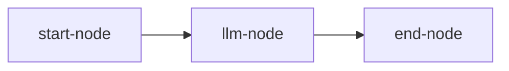
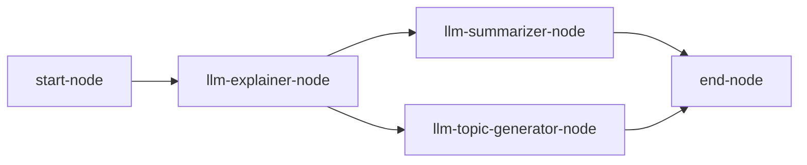

# Examples

Lathe ships three built-in example pipelines, generated with `lathe example <name>`. This page walks through each.

## Simple agent

Generate it with:

```sh
lathe example simple --provider open-ai --model gpt-5-mini
```

This writes `examples/simple_agent.yaml`:

```yaml
graph_version: V1
name: Example Lathe Graph - Simple
nodes:
- !Start
  id: start-node
  label: lathe::nodes::start
- !LLMNode
  id: llm-node
  label: Simple Assistant LLM Node
  provider: OpenAI
  model: gpt-5-mini
  system_prompt: You are a helpful assistant
  input_key: /message
  output_key: /output_message
  provider_config_id: my-model
  tools: []
- !End
  id: end-node
  label: lathe::nodes::end
  out_pointers:
  - /output_message
connections:
- from: start-node
  to: llm-node
  label: lathe::nodes::start to Simple Assistant LLM Node
- from: llm-node
  to: end-node
  label: Simple Assistant LLM Node to lathe::nodes::end
provider_configs:
  my-model:
    id: my-model
    base_url: null
    api_key: null
    provider: OpenAI
```

The graph shape is a straight line:



The LLM node reads `/message` (the input you pass on the command line), sends it to the model with the system prompt "You are a helpful assistant", and writes the response to `/output_message`, which the `End` node surfaces as output.

```sh
lathe run --pipeline examples/simple_agent.yaml --message "Hello!"
```

```json
{
  "output_message": "Hi there! How can I help you today?"
}
```

Only `/output_message` appears as `lathe run` prints the `End` node's selected output (`out_pointers`), not the full internal state. So `/message` isn't included even though it was in the initial state.

## Explainer agent (fan-out)

Generate it with:

```sh
lathe example explainer --provider open-ai --model gpt-5-mini
```

This writes `examples/explainer_agent.yaml`, a five-node pipeline:

```yaml
graph_version: V1
name: Example Lathe Graph - Explainer
nodes:
- !Start
  id: start-node
  label: lathe::nodes::start
- !LLMNode
  id: llm-explainer-node
  label: Explainer LLM Node
  provider: OpenAI
  model: gpt-5-mini
  system_prompt: You are a knowledgeable assistant who explains topics clearly. For the given question or topic, provide a detailed, well-structured explanation that builds from foundational concepts to more nuanced points, using concrete examples where helpful.
  input_key: /message
  output_key: /explanation
  provider_config_id: my-model
  tools: []
- !LLMNode
  id: llm-summarizer-node
  label: Summarizer LLM Node
  provider: OpenAI
  model: gpt-5-mini
  system_prompt: You are an expert in {{/message}} who summarizes text. Given the text, produce a concise summary of two to three sentences that captures the key points while preserving the original meaning.
  input_key: /explanation
  output_key: /summary
  provider_config_id: my-model
  tools: []
- !LLMNode
  id: llm-topic-generator-node
  label: Topic Generator LLM Node
  provider: OpenAI
  model: gpt-5-mini
  system_prompt: You are an expert in {{/message}} who writes titles for text. Given some text, generate a short, descriptive title (five words or fewer) that captures its essence.
  input_key: /explanation
  output_key: /title
  provider_config_id: my-model
  tools: []
- !End
  id: end-node
  label: lathe::nodes::end
  out_pointers:
  - /explanation
  - /summary
  - /title
connections:
- from: start-node
  to: llm-explainer-node
  label: lathe::nodes::start to Explainer LLM Node
- from: llm-explainer-node
  to: llm-summarizer-node
  label: Explainer LLM Node to Summarizer LLM Node
- from: llm-explainer-node
  to: llm-topic-generator-node
  label: Explainer LLM Node to Topic Generator LLM Node
- from: llm-summarizer-node
  to: end-node
  label: Summarizer LLM Node to lathe::nodes::end
- from: llm-topic-generator-node
  to: end-node
  label: Topic Generator LLM Node to lathe::nodes::end
provider_configs:
  my-model:
    id: my-model
    base_url: null
    api_key: null
    provider: OpenAI
```

The graph shape:



`llm-explainer-node` reads the initial `/message` and writes a long explanation to `/explanation`. From there the graph **fans out**: both `llm-summarizer-node` and `llm-topic-generator-node` read `/explanation` and run independently. One writes `/summary`, the other `/title`. The `End` node then **fans in**, surfacing all three: `/explanation`, `/summary`, and `/title`.

Notice that both downstream nodes also template `{{/message}}` into their system prompts (`"You are an expert in {{/message}} who summarizes text..."`) even though `/message` isn't their `input_key`. This works because `AgentState` accumulates. The original message written by `Start` is still there for any later node to read, not just the node it was originally passed to. See [Concepts § AgentState](concepts.md#agentstate) and [§ Template resolution](concepts.md#template-resolution).

```sh
lathe run --pipeline examples/explainer_agent.yaml --message "quantum entanglement"
```

```json
{
  "explanation": "Quantum entanglement is a phenomenon where two or more particles become linked...",
  "summary": "Quantum entanglement links particles so that measuring one instantly affects the other...",
  "title": "Understanding Quantum Entanglement"
}
```

`/message` isn't in the output even though the summarizer and title-generator nodes read it via `{{/message}}` templating. Only the three pointers listed in the `End` node's `out_pointers` (`/explanation`, `/summary`, `/title`) are surfaced.

## Weather agent (tool calling)

Generate it with:

```sh
lathe example weather --provider open-ai --model gpt-5-mini
```

This writes `examples/weather_agent.yaml`, a Start -> LLM -> End pipeline where the LLM node has two `HttpRequest` tools to call:

```yaml
graph_version: V1
name: Example Lathe Graph - Weather
nodes:
- !Start
  id: start-node
  label: lathe::nodes::start
- !LLMNode
  id: llm-node
  label: Simple Assistant LLM Node
  provider: OpenAI
  model: gpt-5-mini
  system_prompt: You are a helpful assistant that can get the weather forecast for a city and can do general smalltalk. If the user does not mention a city, do not generate any weather forecast
  input_key: /message
  output_key: /output_message
  provider_config_id: my-model
  tools:
  - geocode-tool
  - forecast-tool
- !End
  id: end-node
  label: lathe::nodes::end
  out_pointers:
  - /output_message
connections:
- from: start-node
  to: llm-node
  label: lathe::nodes::start to Simple Assistant LLM Node
- from: llm-node
  to: end-node
  label: Simple Assistant LLM Node to lathe::nodes::end
provider_configs:
  my-model:
    id: my-model
    base_url: null
    api_key: null
    provider: OpenAI
tools:
  geocode-tool:
    kind: HttpRequest
    name: geocode-tool
    description: Look Up City Coordinates in Latitude and Longitude
    method: GET
    url: https://nominatim.openstreetmap.org/search?city={{city}}&format=json
    headers:
      User-Agent: lathe-weather-agent/1.0
    body: null
    timeout: 5000
    response_type: Json
    params:
      city:
        type: Text
        description: City name to geocode, e.g. 'Chennai'
  forecast-tool:
    kind: HttpRequest
    name: forecast-tool
    description: Get Weather Forecast for a given latitude and longitude
    method: GET
    url: https://api.open-meteo.com/v1/forecast?latitude={{latitude}}&longitude={{longitude}}&current=temperature_2m,wind_speed_10m
    headers:
      User-Agent: lathe-weather-agent/1.0
    body: null
    timeout: 5000
    response_type: Json
    params:
      longitude:
        type: Float
        description: Longitude of the location, from the geocode-city tool
      latitude:
        type: Float
        description: Latitude of the location, from the geocode-city tool
```

The graph shape is the same straight line as the simple example:


The difference is the `llm-node`'s `tools` list and the top-level `tools` map. When the user's message mentions a city, the model can call `geocode-tool` to resolve it to latitude/longitude via [Nominatim](https://nominatim.openstreetmap.org/), then call `forecast-tool` with those coordinates to fetch current conditions from [Open-Meteo](https://open-meteo.com/), before writing its final reply to `/output_message`. Both tool calls happen inside a single `LLMNode` invocation — see [Concepts § Tools](concepts.md#tools).

```sh
lathe run --pipeline examples/weather_agent.yaml --message "What's the weather like in Chennai?"
```

```json
{
  "output_message": "It's currently around 30°C in Chennai with light winds."
}
```

If the message doesn't mention a city, the model follows the system prompt and skips the tool calls entirely, falling back to smalltalk.

## Serving any example

All three examples work the same way with `lathe server`. The pipeline doesn't change, only how you invoke it:

```sh
lathe server --pipeline examples/explainer_agent.yaml --port 8080
```

```sh
curl -X POST http://127.0.0.1:8080/invoke \
  -H 'Content-Type: application/json' \
  -d '{"message": "quantum entanglement"}'
```

See also: [Pipeline YAML Reference](pipeline-reference.md) for the full schema, and [CLI Reference](cli-reference.md) for every flag.
